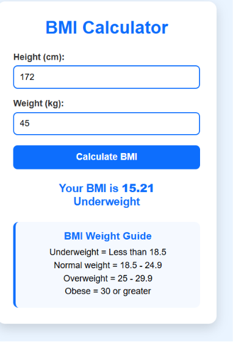
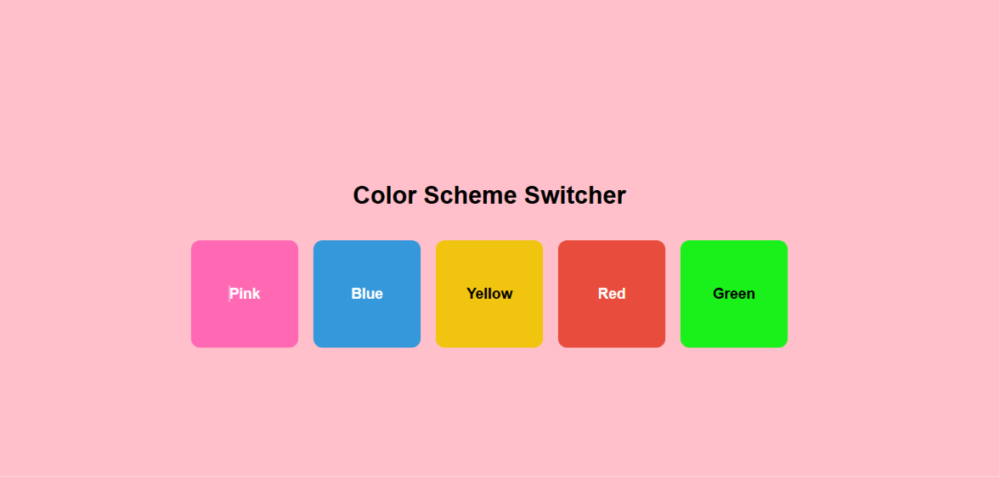
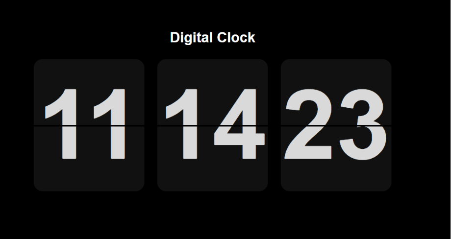
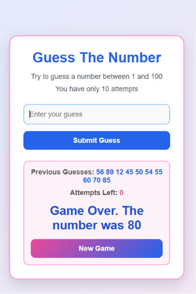
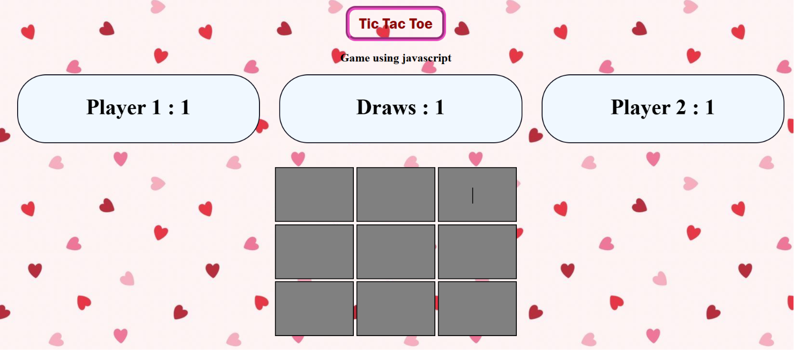
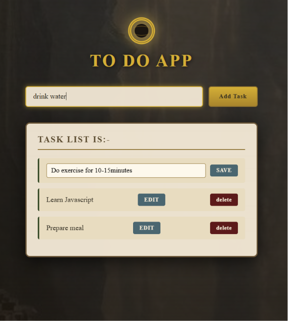
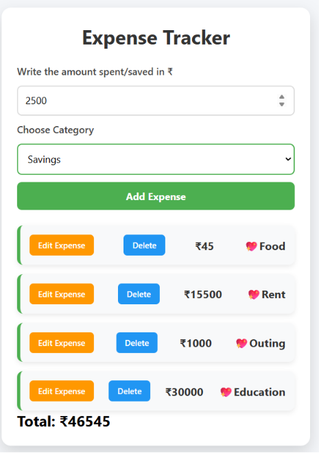
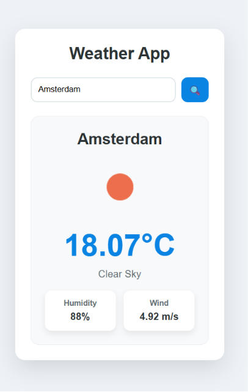
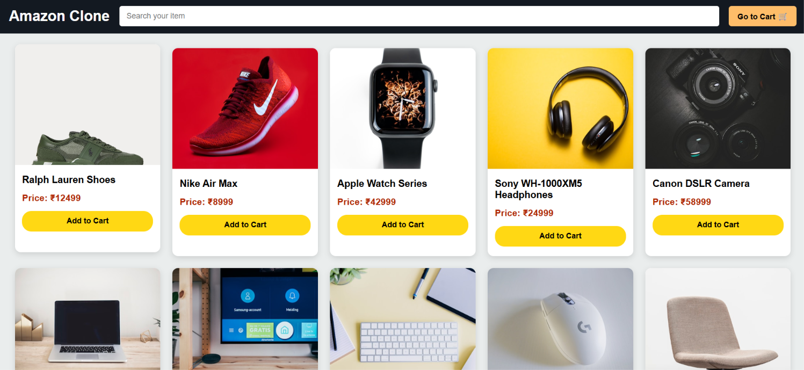

# 🧙‍♀️ The JavaScript Fellowship

> *"All we have to decide is what to do with the code that is given to us."*

A journey from vanilla JS to full-stack mastery — one mini-project, one bug fixed, and one `console.log()` at a time. Welcome to my JS learning repo, forged while following the **Chai aur Code** playlist by Hitesh Choudhary.

---

## 🗺️ The Map (Table of Contents)

- [The Quest](#-the-quest)
- [Artifacts Forged (Projects)](#%EF%B8%8F-artifacts-forged-projects)
- [Lore & Scrolls (Notes)](#-lore--scrolls-notes)
- [Tools of the Trade](#%EF%B8%8F-tools-of-the-trade)
- [What Lies Ahead](#-what-lies-ahead)

---

## 🎯 The Quest

Every great journey starts with a single step — mine started with `var`, `let`, and way too many semicolon debates. This repo is my training ground before I cross into **React** territory and the rest of the full-stack road (Node.js → Express → MongoDB → a full GenAI project).

Each project below was built to slay a specific JS dragon: DOM manipulation, async chaos, state without a framework, or API calls that actually work.

> 📸 Screenshots live in [`screenshots/`](./screenshots) — drop your image files there using the filenames shown under each project below, and they'll render automatically here.

---

## ⚔️ Artifacts Forged (Projects)

### 🧮 BMI Calculator
Calculates BMI from height & weight, and sorts you into a category.

**Skills tested:** Form input handling, basic conditional logic
**Folder:** [`BMI---Calculator`](./BMI---Calculator)

---

### 🎨 Color Changer
Changes background color on the fly with a click.

**Skills tested:** Event listeners, DOM styling
**Folder:** [`Color-Changer`](./Color-Changer)

---

### 🕐 Digital Clock
A live, ticking clock built with vanilla JS.

**Skills tested:** `Date` object, `setInterval`
**Folder:** [`Digital-Clock`](./Digital-Clock)

---

### 🔢 Guess The Number
Classic number-guessing game with hints.

**Skills tested:** Conditionals, loops, game logic
**Folder:** [`Guess-The-Number`](./Guess-The-Number)

---

### ⭕ Tic Tac Toe
Two-player Tic Tac Toe with win detection.

**Skills tested:** Game state, win-condition logic
**Folder:** [`tic-tac-toe`](./tic-tac-toe)

---

### ✅ To-Do App
Task manager with add/complete/delete functionality.

**Skills tested:** Promises, `async`/`await`
**Folder:** [`to-do-app`](./to-do-app)

---

### 💰 Expense Tracker
Tracks income & expenses with running totals.

**Skills tested:** DOM manipulation, `localStorage`
**Folder:** [`expense_tracker`](./expense_tracker)

---

### 🌤️ Weather App
Live weather lookup using the OpenWeather API.

**Skills tested:** `fetch`, async data handling, error handling
**Folder:** [`weather_app`](./weather_app)

---

### 🛒 Amazon Clone
Amazon-style product UI with a built-in to-do list.

**Skills tested:** Layout logic, combining multiple features
**Folder:** [`amazon_clone`](./amazon_clone)

---

## 📖 Lore & Scrolls (Notes)

The [`revision_material`](./revision_material) folder holds my personal revision scrolls — small hands-on files I return to when brushing up on core concepts:

| File | Focus |
|---|---|
| [`event.html`](./revision_material/event.html) | Event listeners revision |
| [`my.html`](./revision_material/my.html) | Event listeners + simple project |
| [`my.js`](./revision_material/my.js) | Expense tracker logic revision |
| [`one.html`](./revision_material/one.html) | Event listeners + simple project |

Broader concepts practiced across this repo:

- 🌳 DOM manipulation & event listeners
- 💾 `localStorage` and browser storage
- ⏳ Async JS — callbacks, Promises, `async`/`await`, `fetch`
- 🧮 Array methods (`map`, `filter`, `reduce`, and friends)
- 🧩 Core JS fundamentals — objects, functions, scope, closures

---

## 🛠️ Tools of the Trade

- **HTML5** — the bones
- **CSS3** — the armor
- **JavaScript (Vanilla)** — the magic

---

## 🚀 What Lies Ahead

This is basecamp, not the summit. Next stops on the map:

- ⚛️ **React** — because manually re-rendering the DOM is *not* the One Ring I want to keep carrying
- 🌐 **Node.js + Express + MongoDB** — the backend realms
- 🤖 **A full-stack GenAI project** — the final boss

---

*"Not all those who wander are lost — some are just debugging."*

⭐ More projects and notes added as the journey continues.

